# 🏗️ MANUAL TÉCNICO - ARQUITECTURA Y BASE DE DATOS
## Sistema de Control de Eventos - Implementación Completa

---

## 📋 ÍNDICE

1. [Arquitectura General](#arquitectura-general)
2. [Stack Tecnológico](#stack-tecnológico)
3. [Estructura de Base de Datos (Supabase)](#estructura-de-base-de-datos)
4. [Relaciones entre Tablas](#relaciones-entre-tablas)
5. [Lógica de Negocio](#lógica-de-negocio)
6. [Flujos Técnicos Detallados](#flujos-técnicos-detallados)
7. [Seguridad y Permisos (RLS)](#seguridad-y-permisos)
8. [Queries y Funciones Útiles](#queries-y-funciones-útiles)
9. [Migraciones Recomendadas](#migraciones-recomendadas)

---

## 🏛️ ARQUITECTURA GENERAL

### Componentes del Sistema

```
┌─────────────────────────────────────────────────────────────┐
│                       FRONTEND (React)                      │
│  - Vite + TypeScript                                        │
│  - Tailwind CSS + Shadcn UI                                 │
│  - React Router                                             │
│  - Context API (Auth)                                       │
└──────────────────────┬──────────────────────────────────────┘
                       │
                       │ REST API / GraphQL
                       │
┌──────────────────────▼──────────────────────────────────────┐
│                    BACKEND (FastAPI)                        │
│  - Python 3.11+                                             │
│  - FastAPI Framework                                        │
│  - Pydantic Models                                          │
│  - JWT Authentication                                       │
└──────────────────────┬──────────────────────────────────────┘
                       │
                       │ SQL / PostgREST
                       │
┌──────────────────────▼──────────────────────────────────────┐
│                  DATABASE (Supabase)                        │
│  - PostgreSQL 15+                                           │
│  - Row Level Security (RLS)                                 │
│  - Triggers & Functions                                     │
│  - Real-time Subscriptions                                  │
└─────────────────────────────────────────────────────────────┘
```

---

## 🛠️ STACK TECNOLÓGICO

### Frontend
```typescript
{
  "framework": "React 18 + Vite",
  "language": "TypeScript 5.x",
  "styling": "Tailwind CSS + Shadcn UI",
  "routing": "React Router v6",
  "state": "React Context API + useState/useEffect",
  "forms": "React Hook Form (opcional)",
  "notifications": "Sonner (toast)",
  "storage": "localStorage (demo) → Supabase (production)"
}
```

### Backend
```python
{
  "framework": "FastAPI 0.100+",
  "language": "Python 3.11+",
  "database_client": "Supabase Python Client",
  "auth": "JWT + Supabase Auth",
  "validation": "Pydantic v2",
  "cors": "FastAPI CORS Middleware"
}
```

### Database
```sql
{
  "engine": "PostgreSQL 15+",
  "hosting": "Supabase",
  "features": [
    "Row Level Security (RLS)",
    "Database Functions",
    "Triggers",
    "Real-time Subscriptions",
    "PostgREST API"
  ]
}
```

---

## 🗄️ ESTRUCTURA DE BASE DE DATOS (SUPABASE)

### TABLA 1: `users`
**Propósito:** Gestión de usuarios y roles del sistema

```sql
CREATE TABLE users (
  -- Identificación
  id UUID PRIMARY KEY DEFAULT uuid_generate_v4(),
  email VARCHAR(255) UNIQUE NOT NULL,
  name VARCHAR(100) NOT NULL,
  last_name VARCHAR(100) NOT NULL,
  
  -- Autenticación (vinculado con Supabase Auth)
  auth_user_id UUID REFERENCES auth.users(id) ON DELETE CASCADE,
  
  -- Rol y permisos
  role_id INTEGER REFERENCES roles(id) NOT NULL,
  is_active BOOLEAN DEFAULT true,
  
  -- Información adicional
  phone VARCHAR(20),
  profile_picture_url TEXT,
  
  -- Auditoría
  created_at TIMESTAMP WITH TIME ZONE DEFAULT NOW(),
  updated_at TIMESTAMP WITH TIME ZONE DEFAULT NOW(),
  last_login TIMESTAMP WITH TIME ZONE
);

-- Índices
CREATE INDEX idx_users_email ON users(email);
CREATE INDEX idx_users_role ON users(role_id);
CREATE INDEX idx_users_auth ON users(auth_user_id);
```

**Datos de ejemplo:**
```sql
INSERT INTO users (email, name, last_name, role_id) VALUES
  ('admin@eventos.com', 'Admin', 'Sistema', 1),
  ('coordinador@eventos.com', 'Carlos', 'Rodríguez', 2),
  ('compras@eventos.com', 'María', 'González', 3);
```

---

### TABLA 2: `roles`
**Propósito:** Definición de roles y permisos

```sql
CREATE TABLE roles (
  id SERIAL PRIMARY KEY,
  name VARCHAR(50) UNIQUE NOT NULL,
  display_name VARCHAR(100) NOT NULL,
  description TEXT,
  
  -- Permisos por módulo (JSON para flexibilidad)
  permissions JSONB DEFAULT '{}'::jsonb,
  
  -- Auditoría
  created_at TIMESTAMP WITH TIME ZONE DEFAULT NOW(),
  updated_at TIMESTAMP WITH TIME ZONE DEFAULT NOW()
);
```

**Datos de ejemplo:**
```sql
INSERT INTO roles (id, name, display_name, permissions) VALUES
  (1, 'admin', 'Administrador', '{
    "events": {"create": true, "read": true, "update": true, "delete": true},
    "expenses": {"create": true, "read": true, "update": true, "delete": true},
    "incomes": {"create": true, "read": true, "update": true, "delete": true},
    "warehouse": {"create": true, "read": true, "update": true, "delete": true},
    "statistics": {"read": true},
    "clients": {"create": true, "read": true, "update": true, "delete": true},
    "reservations": {"read": true}
  }'),
  (2, 'coordinador', 'Coordinador', '{
    "events": {"read": "assigned_only"},
    "expenses": {"create": "additional_only", "read": "assigned_only"},
    "incomes": {"create": "kiosko_horas_only", "read": "assigned_only"},
    "warehouse": {"read": "own_only", "create": true}
  }'),
  (3, 'encargado_compras', 'Encargado de Compras', '{
    "events": {"read": "assigned_only"},
    "expenses": {"create": "food_only", "read": "assigned_only"}
  }');
```

---

### TABLA 3: `clients`
**Propósito:** Base de datos de clientes

```sql
CREATE TABLE clients (
  id UUID PRIMARY KEY DEFAULT uuid_generate_v4(),
  
  -- Información personal
  name VARCHAR(100) NOT NULL,
  last_name VARCHAR(100),
  email VARCHAR(255),
  phone VARCHAR(20) NOT NULL,
  
  -- Información adicional
  tipo_cliente VARCHAR(20) CHECK (tipo_cliente IN ('individual', 'corporativo')),
  company VARCHAR(200),
  address TEXT,
  document_type VARCHAR(20),
  document_number VARCHAR(50),
  
  -- Auditoría
  created_at TIMESTAMP WITH TIME ZONE DEFAULT NOW(),
  updated_at TIMESTAMP WITH TIME ZONE DEFAULT NOW(),
  created_by UUID REFERENCES users(id)
);

-- Índices
CREATE INDEX idx_clients_email ON clients(email);
CREATE INDEX idx_clients_phone ON clients(phone);
CREATE INDEX idx_clients_document ON clients(document_number);
```

---

### TABLA 4: `events`
**Propósito:** Tabla principal de eventos

```sql
CREATE TABLE events (
  id UUID PRIMARY KEY DEFAULT uuid_generate_v4(),
  
  -- Relaciones
  client_id UUID REFERENCES clients(id) ON DELETE RESTRICT,
  assigned_to UUID REFERENCES users(id), -- Usuario asignado
  
  -- Información básica
  event_name VARCHAR(200) NOT NULL,
  event_type VARCHAR(50) CHECK (event_type IN (
    'quince_años', 'boda', 'cumpleaños', 'corporativo', 'otro'
  )),
  status VARCHAR(50) DEFAULT 'draft' CHECK (status IN (
    'draft', 'confirmed', 'in_progress', 'completed', 'cancelled'
  )),
  
  -- Tipo de registro
  is_reservation BOOLEAN DEFAULT false, -- true = reserva, false = evento completo
  
  -- Detalles del evento
  event_date DATE NOT NULL,
  event_time TIME,
  location TEXT,
  num_guests INTEGER,
  service_type VARCHAR(50) CHECK (service_type IN ('con_comida', 'solo_alquiler')),
  
  -- Notas
  notes TEXT,
  special_requirements TEXT,
  
  -- Auditoría
  created_at TIMESTAMP WITH TIME ZONE DEFAULT NOW(),
  updated_at TIMESTAMP WITH TIME ZONE DEFAULT NOW(),
  created_by UUID REFERENCES users(id),
  updated_by UUID REFERENCES users(id)
);

-- Índices
CREATE INDEX idx_events_client ON events(client_id);
CREATE INDEX idx_events_assigned ON events(assigned_to);
CREATE INDEX idx_events_date ON events(event_date);
CREATE INDEX idx_events_status ON events(status);
CREATE INDEX idx_events_type ON events(is_reservation);
```

---

### TABLA 5: `event_contracts`
**Propósito:** Información de contratos y financiera del evento

```sql
CREATE TABLE event_contracts (
  id UUID PRIMARY KEY DEFAULT uuid_generate_v4(),
  event_id UUID REFERENCES events(id) ON DELETE CASCADE UNIQUE,
  
  -- Financiero
  precio_total DECIMAL(10, 2) NOT NULL DEFAULT 0,
  pago_adelantado DECIMAL(10, 2) DEFAULT 0,
  saldo_pendiente DECIMAL(10, 2) GENERATED ALWAYS AS (precio_total - pago_adelantado) STORED,
  
  -- Presupuesto
  presupuesto_asignado DECIMAL(10, 2) DEFAULT 0, -- Caja chica
  garantia DECIMAL(10, 2) DEFAULT 0,
  
  -- Documentos
  contrato_foto_url TEXT,
  
  -- Tracking de modificaciones de caja chica
  caja_chica_history JSONB DEFAULT '[]'::jsonb,
  
  -- Auditoría
  created_at TIMESTAMP WITH TIME ZONE DEFAULT NOW(),
  updated_at TIMESTAMP WITH TIME ZONE DEFAULT NOW()
);

-- Índice
CREATE INDEX idx_contracts_event ON event_contracts(event_id);
```

---

### TABLA 6: `event_food_details`
**Propósito:** Detalles de comida del evento

```sql
CREATE TABLE event_food_details (
  id UUID PRIMARY KEY DEFAULT uuid_generate_v4(),
  event_id UUID REFERENCES events(id) ON DELETE CASCADE UNIQUE,
  
  -- Plato principal
  tipo_de_plato VARCHAR(100) NOT NULL,
  cantidad_de_platos INTEGER NOT NULL,
  precio_por_plato DECIMAL(10, 2) NOT NULL,
  
  -- Cerveza (si aplica)
  incluye_cerveza BOOLEAN DEFAULT false,
  numero_cajas_cerveza INTEGER,
  costo_por_caja DECIMAL(10, 2),
  tipo_de_pago VARCHAR(50) CHECK (tipo_de_pago IN ('cover', 'compra_local')),
  
  -- Plato seleccionado para cálculo dinámico
  selected_dish_id VARCHAR(100), -- dish_id de la guía
  
  -- Auditoría
  created_at TIMESTAMP WITH TIME ZONE DEFAULT NOW(),
  updated_at TIMESTAMP WITH TIME ZONE DEFAULT NOW()
);

-- Índice
CREATE INDEX idx_food_event ON event_food_details(event_id);
```

---

### TABLA 7: `event_beverages`
**Propósito:** Bebidas del evento

```sql
CREATE TABLE event_beverages (
  id UUID PRIMARY KEY DEFAULT uuid_generate_v4(),
  event_id UUID REFERENCES events(id) ON DELETE CASCADE,
  
  -- Tipo de bebida
  tipo VARCHAR(50) NOT NULL CHECK (tipo IN (
    'gaseosa', 'agua', 'champan', 'vino', 'cerveza', 'coctel'
  )),
  
  -- Cantidades
  cantidad INTEGER, -- Unidades/Cajas/Cocteles
  litros DECIMAL(10, 2),
  
  -- Precios según tipo
  precio_unitario DECIMAL(10, 2), -- Para gaseosa, agua, champán, vino
  
  -- Para cerveza
  numero_cajas INTEGER,
  modalidad VARCHAR(50) CHECK (modalidad IN ('cover', 'compra_local')),
  costo_por_caja DECIMAL(10, 2),
  costo_caja_local DECIMAL(10, 2),
  costo_caja_cliente DECIMAL(10, 2),
  
  -- Para cóctel
  costo_coctel_local DECIMAL(10, 2),
  costo_coctel_cliente DECIMAL(10, 2),
  utilidad DECIMAL(10, 2),
  
  -- Auditoría
  created_at TIMESTAMP WITH TIME ZONE DEFAULT NOW(),
  created_by UUID REFERENCES users(id)
);

-- Índice
CREATE INDEX idx_beverages_event ON event_beverages(event_id);
```

---

### TABLA 8: `event_decoration`
**Propósito:** Items de decoración del evento

```sql
CREATE TABLE event_decoration (
  id UUID PRIMARY KEY DEFAULT uuid_generate_v4(),
  event_id UUID REFERENCES events(id) ON DELETE CASCADE,
  
  -- Descripción
  item VARCHAR(200) NOT NULL,
  quantity INTEGER DEFAULT 1,
  
  -- Precios
  unit_price DECIMAL(10, 2) NOT NULL,
  total_price DECIMAL(10, 2) NOT NULL,
  
  -- Proveedor
  supplier VARCHAR(200),
  provider_cost DECIMAL(10, 2), -- Costo con proveedor
  profit DECIMAL(10, 2) GENERATED ALWAYS AS (total_price - COALESCE(provider_cost, 0)) STORED,
  
  -- Estado
  estado VARCHAR(50) DEFAULT 'pendiente' CHECK (estado IN (
    'pendiente', 'comprado', 'instalado'
  )),
  
  -- IMPORTANTE: Adelantos y pagos
  estado_pago VARCHAR(50) DEFAULT 'pendiente' CHECK (estado_pago IN (
    'pendiente', 'adelanto', 'pagado'
  )),
  monto_pagado DECIMAL(10, 2) DEFAULT 0,
  
  -- Historial de pagos (para tracking múltiple)
  payment_history JSONB DEFAULT '[]'::jsonb,
  
  -- Notas
  notes TEXT,
  
  -- Auditoría
  created_at TIMESTAMP WITH TIME ZONE DEFAULT NOW(),
  created_by UUID REFERENCES users(id),
  updated_at TIMESTAMP WITH TIME ZONE DEFAULT NOW()
);

-- Índice
CREATE INDEX idx_decoration_event ON event_decoration(event_id);
```

---

### TABLA 9: `event_staff`
**Propósito:** Personal asignado al evento

```sql
CREATE TABLE event_staff (
  id UUID PRIMARY KEY DEFAULT uuid_generate_v4(),
  event_id UUID REFERENCES events(id) ON DELETE CASCADE,
  
  -- Información del personal
  name VARCHAR(100) NOT NULL,
  role VARCHAR(100) NOT NULL, -- Mesero, Chef, DJ, Seguridad, etc.
  
  -- Costos
  hours_worked DECIMAL(5, 2) NOT NULL,
  cost_per_hour DECIMAL(10, 2) NOT NULL,
  total_cost DECIMAL(10, 2) GENERATED ALWAYS AS (hours_worked * cost_per_hour) STORED,
  
  -- Estado de pago
  payment_status VARCHAR(50) DEFAULT 'pendiente' CHECK (payment_status IN (
    'pendiente', 'adelanto', 'pagado'
  )),
  amount_paid DECIMAL(10, 2) DEFAULT 0,
  
  -- Auditoría
  created_at TIMESTAMP WITH TIME ZONE DEFAULT NOW(),
  created_by UUID REFERENCES users(id)
);

-- Índice
CREATE INDEX idx_staff_event ON event_staff(event_id);
```

---

### TABLA 10: `event_expenses`
**Propósito:** Gastos del evento (ingredientes, gastos adicionales, etc.)

```sql
CREATE TABLE event_expenses (
  id UUID PRIMARY KEY DEFAULT uuid_generate_v4(),
  event_id UUID REFERENCES events(id) ON DELETE CASCADE,
  
  -- Categoría
  category VARCHAR(50) NOT NULL CHECK (category IN (
    'kiosco', 'pollo', 'verduras', 'decoracion', 'mobiliario', 
    'personal', 'salchichas', 'papas', 'cerveza', 'vigilancia', 
    'limpieza', 'otros'
  )),
  
  -- Descripción y cantidades
  description TEXT NOT NULL,
  cantidad DECIMAL(10, 2) NOT NULL,
  costo_unitario DECIMAL(10, 2) NOT NULL,
  amount DECIMAL(10, 2) NOT NULL, -- Total
  unit VARCHAR(50), -- kg, unidad, litros, etc.
  
  -- Tipo de gasto
  is_predetermined BOOLEAN DEFAULT false, -- true = ingrediente, false = adicional
  
  -- Método de pago
  payment_method VARCHAR(50) CHECK (payment_method IN (
    'efectivo', 'tarjeta', 'transferencia', 'yape'
  )),
  
  -- Tracking (IMPORTANTE)
  registered_by UUID REFERENCES users(id) NOT NULL,
  registered_by_name VARCHAR(200) NOT NULL,
  registered_at TIMESTAMP WITH TIME ZONE DEFAULT NOW(),
  
  -- Documentos
  receipt_url TEXT,
  
  -- Fecha del gasto
  expense_date DATE DEFAULT CURRENT_DATE,
  
  -- Auditoría
  created_at TIMESTAMP WITH TIME ZONE DEFAULT NOW()
);

-- Índices
CREATE INDEX idx_expenses_event ON event_expenses(event_id);
CREATE INDEX idx_expenses_category ON event_expenses(category);
CREATE INDEX idx_expenses_user ON event_expenses(registered_by);
CREATE INDEX idx_expenses_date ON event_expenses(expense_date);
```

---

### TABLA 11: `event_incomes`
**Propósito:** Ingresos del evento

```sql
CREATE TABLE event_incomes (
  id UUID PRIMARY KEY DEFAULT uuid_generate_v4(),
  event_id UUID REFERENCES events(id) ON DELETE CASCADE,
  
  -- Tipo de ingreso
  income_type VARCHAR(50) NOT NULL CHECK (income_type IN (
    'pago_comida', 'pago_alquiler', 'kiosco', 'horas_extras', 'adicional'
  )),
  
  -- Descripción y monto
  description TEXT,
  amount DECIMAL(10, 2) NOT NULL,
  
  -- Método de pago
  payment_method VARCHAR(50) CHECK (payment_method IN (
    'efectivo', 'tarjeta', 'transferencia', 'yape'
  )),
  
  -- Tracking
  registered_by UUID REFERENCES users(id) NOT NULL,
  registered_by_name VARCHAR(200) NOT NULL,
  registered_at TIMESTAMP WITH TIME ZONE DEFAULT NOW(),
  
  -- Fecha del ingreso
  income_date DATE DEFAULT CURRENT_DATE,
  
  -- Auditoría
  created_at TIMESTAMP WITH TIME ZONE DEFAULT NOW()
);

-- Índices
CREATE INDEX idx_incomes_event ON event_incomes(event_id);
CREATE INDEX idx_incomes_type ON event_incomes(income_type);
CREATE INDEX idx_incomes_user ON event_incomes(registered_by);
```

---

### TABLA 12: `warehouse_movements`
**Propósito:** Movimientos del almacén

```sql
CREATE TABLE warehouse_movements (
  id UUID PRIMARY KEY DEFAULT uuid_generate_v4(),
  
  -- Producto
  product_name VARCHAR(200) NOT NULL,
  category VARCHAR(50),
  
  -- Movimiento
  movement_type VARCHAR(50) NOT NULL CHECK (movement_type IN (
    'entrada', 'salida', 'ajuste'
  )),
  quantity DECIMAL(10, 2) NOT NULL,
  unit VARCHAR(50), -- kg, unidades, litros
  
  -- Relacionado con evento (opcional)
  event_id UUID REFERENCES events(id) ON DELETE SET NULL,
  
  -- Tracking
  registered_by UUID REFERENCES users(id) NOT NULL,
  registered_by_name VARCHAR(200) NOT NULL,
  registered_at TIMESTAMP WITH TIME ZONE DEFAULT NOW(),
  
  -- Notas
  notes TEXT,
  
  -- Auditoría
  created_at TIMESTAMP WITH TIME ZONE DEFAULT NOW()
);

-- Índices
CREATE INDEX idx_warehouse_product ON warehouse_movements(product_name);
CREATE INDEX idx_warehouse_user ON warehouse_movements(registered_by);
CREATE INDEX idx_warehouse_event ON warehouse_movements(event_id);
CREATE INDEX idx_warehouse_date ON warehouse_movements(created_at);
```

---

### TABLA 13: `audit_log`
**Propósito:** Log de auditoría completo del sistema

```sql
CREATE TABLE audit_log (
  id UUID PRIMARY KEY DEFAULT uuid_generate_v4(),
  
  -- Relaciones
  event_id UUID REFERENCES events(id) ON DELETE SET NULL,
  user_id UUID REFERENCES users(id) NOT NULL,
  
  -- Información del usuario
  user_name VARCHAR(200) NOT NULL,
  user_role VARCHAR(50) NOT NULL,
  
  -- Acción
  action VARCHAR(50) NOT NULL CHECK (action IN (
    'created', 'updated', 'deleted', 'added', 'removed'
  )),
  section VARCHAR(100) NOT NULL, -- Eventos, Gastos, Ingresos, etc.
  description TEXT NOT NULL,
  
  -- Datos adicionales (JSON para flexibilidad)
  metadata JSONB DEFAULT '{}'::jsonb,
  
  -- Timestamp
  timestamp TIMESTAMP WITH TIME ZONE DEFAULT NOW()
);

-- Índices
CREATE INDEX idx_audit_event ON audit_log(event_id);
CREATE INDEX idx_audit_user ON audit_log(user_id);
CREATE INDEX idx_audit_timestamp ON audit_log(timestamp);
CREATE INDEX idx_audit_action ON audit_log(action);
```

---

## 🔗 RELACIONES ENTRE TABLAS

### Diagrama de Relaciones

```
users (1) ──────────── (N) events (assigned_to)
  │                         │
  │                         ├─── (1) event_contracts
  │                         ├─── (1) event_food_details
  │                         ├─── (N) event_beverages
  │                         ├─── (N) event_decoration
  │                         ├─── (N) event_staff
  │                         ├─── (N) event_expenses
  │                         └─── (N) event_incomes
  │
  ├─── (N) warehouse_movements (registered_by)
  └─── (N) audit_log (user_id)

clients (1) ───────── (N) events (client_id)

roles (1) ─────────── (N) users (role_id)

events (1) ────────── (N) warehouse_movements (event_id, opcional)
events (1) ────────── (N) audit_log (event_id, opcional)
```

---

## 🧠 LÓGICA DE NEGOCIO

### 1. Sistema de Ingredientes Dinámicos

**Catálogo de Platos (Frontend - ingredientsData.ts):**

```typescript
// Este catálogo vive en el frontend para cálculos rápidos
export const DISH_INGREDIENTS = [
  {
    dishId: 'pollo-parrilla',
    dishName: 'Pollo a la Parrilla',
    ingredients: [
      { 
        name: 'Cuarto de pollo', 
        quantityPerPortion: 1, 
        unit: 'unidad', 
        category: 'pollo', 
        estimatedCost: 8.5 
      },
      { 
        name: 'Papa', 
        quantityPerPortion: 2, 
        unit: 'unidad', 
        category: 'verduras', 
        estimatedCost: 0.5 
      },
      // ... más ingredientes
    ]
  },
  // ... más platos
];

// Función de cálculo
export function calculateTotalIngredients(dishId: string, portions: number) {
  const dish = DISH_INGREDIENTS.find(d => d.dishId === dishId);
  if (!dish) return null;
  
  const ingredients = dish.ingredients.map(ing => ({
    name: ing.name,
    category: ing.category,
    unit: ing.unit,
    totalQuantity: ing.quantityPerPortion * portions,
    estimatedCost: ing.estimatedCost,
    totalCost: ing.quantityPerPortion * portions * ing.estimatedCost
  }));
  
  return { dishName: dish.dishName, ingredients };
}
```

**Flujo de Registro de Ingredientes:**

1. **Usuario selecciona plato** → `event_food_details.selected_dish_id = 'pollo-parrilla'`
2. **Frontend calcula** ingredientes necesarios usando `calculateTotalIngredients()`
3. **Filtra verduras comunes** (tomate, lechuga, cebolla, etc.)
4. **Muestra lista dinámica** de ingredientes sin precios pre-rellenados
5. **Usuario ingresa manualmente:**
   - Cantidad real comprada
   - Costo unitario real
6. **Usuario hace click en "Registrar"**
7. **Se guarda en `event_expenses`:**
   ```sql
   INSERT INTO event_expenses (
     event_id, category, description, cantidad, 
     costo_unitario, amount, is_predetermined,
     registered_by, registered_by_name
   ) VALUES (
     event_uuid, 'pollo', 'Cuarto de pollo (pollo-parrilla)',
     10.5, 8.50, 89.25, true,
     user_uuid, 'María González'
   );
   ```

---

### 2. Gestión de Verduras Separada

**Catálogo de Verduras (Frontend):**

```typescript
export const VEGETABLE_OPTIONS = [
  { name: 'Tomate', pricePerKg: 3.5 },
  { name: 'Lechuga', pricePerKg: 2.8 },
  { name: 'Zanahoria', pricePerKg: 2.5 },
  { name: 'Cebolla', pricePerKg: 3.2 },
  { name: 'Pimiento', pricePerKg: 4.0 },
  { name: 'Pepino', pricePerKg: 2.5 },
  { name: 'Limón', pricePerKg: 4.5 },
  { name: 'Culantro', pricePerKg: 5.0 },
];

export const CHILI_OPTIONS = [
  { name: 'Ají Rojo', pricePerKg: 6.0 },
  { name: 'Ají Amarillo', pricePerKg: 7.0 },
  { name: 'Ají Panka', pricePerKg: 8.0 },
];
```

**Flujo:**
1. Usuario selecciona verdura (sin ver precio en dropdown)
2. Ingresa kg y precio manual
3. Se agregan a lista temporal
4. Click "Registrar Verduras" → guarda todas en `event_expenses` con `category='verduras'`

---

### 3. Tracking de Usuarios

**Cada acción registra:**
- `registered_by` (UUID del usuario)
- `registered_by_name` (Nombre completo)
- `registered_at` (timestamp)

**Query para obtener tracking:**
```sql
SELECT 
  description,
  amount,
  registered_by_name,
  registered_at
FROM event_expenses
WHERE event_id = $1 AND is_predetermined = true
ORDER BY registered_at DESC;
```

---

### 4. Adelantos de Decoración

**Flujo en creación de evento:**
1. Paso 4 - Usuario registra decoración con `estadoPago='adelanto'` y `montoPagado=500`
2. Se guarda en `event_decoration`:
   ```sql
   INSERT INTO event_decoration (
     event_id, item, total_price, provider_cost,
     estado_pago, monto_pagado, payment_history
   ) VALUES (
     event_uuid, 'Paquete Premium', 2500, 2000,
     'adelanto', 500, 
     '[{"monto": 500, "fecha": "2025-06-15", "registrado_por": "Admin Sistema", "tipo": "adelanto"}]'
   );
   ```

**En EventDecorationTab:**
- Lee `monto_pagado` y `payment_history`
- Muestra historial de pagos
- Permite agregar más pagos

---

### 5. Caja Chica Modificable

**Estructura en `event_contracts`:**
```sql
{
  "presupuesto_asignado": 5000,
  "caja_chica_history": [
    {
      "monto_anterior": 5000,
      "monto_nuevo": 6000,
      "modificado_por": "Admin Sistema",
      "modificado_por_id": "uuid",
      "fecha": "2025-06-15T10:30:00Z",
      "razon": "Ampliación por gastos extras"
    }
  ]
}
```

**Función para modificar:**
```sql
CREATE OR REPLACE FUNCTION update_caja_chica(
  p_event_id UUID,
  p_new_amount DECIMAL,
  p_user_id UUID,
  p_user_name VARCHAR,
  p_reason TEXT
) RETURNS VOID AS $$
DECLARE
  v_old_amount DECIMAL;
BEGIN
  -- Obtener monto actual
  SELECT presupuesto_asignado INTO v_old_amount
  FROM event_contracts
  WHERE event_id = p_event_id;
  
  -- Actualizar y agregar al historial
  UPDATE event_contracts
  SET 
    presupuesto_asignado = p_new_amount,
    caja_chica_history = caja_chica_history || jsonb_build_object(
      'monto_anterior', v_old_amount,
      'monto_nuevo', p_new_amount,
      'modificado_por', p_user_name,
      'modificado_por_id', p_user_id,
      'fecha', NOW(),
      'razon', p_reason
    ),
    updated_at = NOW()
  WHERE event_id = p_event_id;
  
  -- Auditoría
  INSERT INTO audit_log (event_id, user_id, user_name, user_role, action, section, description)
  VALUES (
    p_event_id, p_user_id, p_user_name, 'admin', 'updated', 'Caja Chica',
    format('Modificó caja chica de S/ %s a S/ %s. Razón: %s', v_old_amount, p_new_amount, p_reason)
  );
END;
$$ LANGUAGE plpgsql;
```

---

## 🔐 SEGURIDAD Y PERMISOS (RLS)

### Row Level Security - Políticas por Tabla

#### **1. Política para `events`**

```sql
-- Habilitar RLS
ALTER TABLE events ENABLE ROW LEVEL SECURITY;

-- Admin ve todo
CREATE POLICY "Admins can view all events" ON events
  FOR SELECT
  USING (
    EXISTS (
      SELECT 1 FROM users
      WHERE users.id = auth.uid()
      AND users.role_id = 1
    )
  );

-- Coordinador y Encargado solo ven eventos asignados
CREATE POLICY "Users see assigned events" ON events
  FOR SELECT
  USING (
    EXISTS (
      SELECT 1 FROM users
      WHERE users.id = auth.uid()
      AND (users.role_id IN (2, 3))
      AND events.assigned_to = users.id
    )
  );

-- Solo admin puede crear/modificar/eliminar
CREATE POLICY "Only admins can modify events" ON events
  FOR ALL
  USING (
    EXISTS (
      SELECT 1 FROM users
      WHERE users.id = auth.uid()
      AND users.role_id = 1
    )
  );
```

#### **2. Política para `event_expenses`**

```sql
ALTER TABLE event_expenses ENABLE ROW LEVEL SECURITY;

-- Admin ve todo
CREATE POLICY "Admins can view all expenses" ON event_expenses
  FOR SELECT
  USING (
    EXISTS (
      SELECT 1 FROM users
      WHERE users.id = auth.uid()
      AND users.role_id = 1
    )
  );

-- Encargado de Compras solo ve/crea gastos de comida de eventos asignados
CREATE POLICY "Encargado compras can manage food expenses" ON event_expenses
  FOR ALL
  USING (
    EXISTS (
      SELECT 1 FROM users u
      JOIN events e ON e.assigned_to = u.id
      WHERE u.id = auth.uid()
      AND u.role_id = 3
      AND e.id = event_expenses.event_id
      AND event_expenses.category IN ('pollo', 'verduras', 'otros')
    )
  );

-- Coordinador solo ve/crea gastos adicionales de eventos asignados
CREATE POLICY "Coordinador can manage additional expenses" ON event_expenses
  FOR ALL
  USING (
    EXISTS (
      SELECT 1 FROM users u
      JOIN events e ON e.assigned_to = u.id
      WHERE u.id = auth.uid()
      AND u.role_id = 2
      AND e.id = event_expenses.event_id
      AND event_expenses.category = 'otros'
    )
  );
```

#### **3. Política para `event_incomes`**

```sql
ALTER TABLE event_incomes ENABLE ROW LEVEL SECURITY;

-- Admin ve y modifica todo
CREATE POLICY "Admins can manage all incomes" ON event_incomes
  FOR ALL
  USING (
    EXISTS (
      SELECT 1 FROM users
      WHERE users.id = auth.uid()
      AND users.role_id = 1
    )
  );

-- Coordinador solo ve/crea kiosco y horas extras de eventos asignados
CREATE POLICY "Coordinador can manage limited incomes" ON event_incomes
  FOR ALL
  USING (
    EXISTS (
      SELECT 1 FROM users u
      JOIN events e ON e.assigned_to = u.id
      WHERE u.id = auth.uid()
      AND u.role_id = 2
      AND e.id = event_incomes.event_id
      AND event_incomes.income_type IN ('kiosco', 'horas_extras')
    )
  );
```

#### **4. Política para `warehouse_movements`**

```sql
ALTER TABLE warehouse_movements ENABLE ROW LEVEL SECURITY;

-- Admin ve todo
CREATE POLICY "Admins can view all warehouse" ON warehouse_movements
  FOR SELECT
  USING (
    EXISTS (
      SELECT 1 FROM users
      WHERE users.id = auth.uid()
      AND users.role_id = 1
    )
  );

-- Coordinador solo ve sus propios movimientos
CREATE POLICY "Coordinador sees own movements" ON warehouse_movements
  FOR SELECT
  USING (
    EXISTS (
      SELECT 1 FROM users
      WHERE users.id = auth.uid()
      AND users.role_id = 2
      AND warehouse_movements.registered_by = users.id
    )
  );

-- Coordinador puede crear sus movimientos
CREATE POLICY "Coordinador can create movements" ON warehouse_movements
  FOR INSERT
  WITH CHECK (
    EXISTS (
      SELECT 1 FROM users
      WHERE users.id = auth.uid()
      AND users.role_id = 2
    )
  );
```

---

## 🔄 FLUJOS TÉCNICOS DETALLADOS

### FLUJO 1: Crear Evento Completo


---

### FLUJO 2: Registrar Ingrediente Dinámico


---

### FLUJO 3: Registrar Verduras (Batch)


---

### FLUJO 4: Modificar Caja Chica

```mermaid
sequenceDiagram
    participant U as Admin
    participant F as Frontend
    participant B as Backend API
    participant DB as Supabase

    U->>F: Click "Modificar" en Caja Chica
    F->>U: Modal con monto actual
    U->>F: Ingresa nuevo monto y razón
    U->>F: Click "Guardar"
    
    F->>B: PATCH /api/events/{id}/contract/budget
    Note over F,B: {new_amount, reason}
    
    B->>B: Valida que user es Admin
    
    B->>DB: SELECT update_caja_chica(...)
    Note over B,DB: Función que actualiza y registra historial
    
    DB->>DB: UPDATE event_contracts
    DB->>DB: Append to caja_chica_history
    DB->>DB: INSERT INTO audit_log
    
    DB-->>B: Success
    B-->>F: Updated budget
    
    F->>F: Actualiza vista
    F->>U: Muestra nuevo presupuesto y tracking
```



---

## 📊 QUERIES Y FUNCIONES ÚTILES

### 1. Obtener Resumen Financiero de Evento

```sql
CREATE OR REPLACE FUNCTION get_event_financial_summary(p_event_id UUID)
RETURNS TABLE (
  total_expenses DECIMAL,
  comida_insumos DECIMAL,
  verduras_total DECIMAL,
  bebidas_total DECIMAL,
  decoracion_total DECIMAL,
  personal_total DECIMAL,
  gastos_adicionales DECIMAL,
  total_incomes DECIMAL,
  presupuesto_asignado DECIMAL,
  balance DECIMAL
) AS $$
BEGIN
  RETURN QUERY
  SELECT
    -- Total gastos
    COALESCE(SUM(e.amount), 0) as total_expenses,
    
    -- Comida insumos (sin verduras)
    COALESCE(SUM(CASE WHEN e.is_predetermined = true AND e.category != 'verduras' THEN e.amount ELSE 0 END), 0) as comida_insumos,
    
    -- Verduras
    COALESCE(SUM(CASE WHEN e.category = 'verduras' THEN e.amount ELSE 0 END), 0) as verduras_total,
    
    -- Bebidas
    (SELECT COALESCE(SUM(
      CASE 
        WHEN tipo IN ('gaseosa', 'agua', 'champan', 'vino') THEN cantidad * precio_unitario
        WHEN tipo = 'cerveza' AND modalidad = 'cover' THEN numero_cajas * costo_por_caja
        WHEN tipo = 'cerveza' AND modalidad = 'compra_local' THEN cantidad * costo_caja_local
        WHEN tipo = 'coctel' AND modalidad = 'cover' THEN 0
        WHEN tipo = 'coctel' AND modalidad = 'compra_local' THEN cantidad * costo_coctel_local
        ELSE 0
      END
    ), 0) FROM event_beverages WHERE event_id = p_event_id) as bebidas_total,
    
    -- Decoración
    (SELECT COALESCE(SUM(provider_cost), 0) FROM event_decoration WHERE event_id = p_event_id) as decoracion_total,
    
    -- Personal
    (SELECT COALESCE(SUM(total_cost), 0) FROM event_staff WHERE event_id = p_event_id) as personal_total,
    
    -- Gastos adicionales
    COALESCE(SUM(CASE WHEN e.is_predetermined = false THEN e.amount ELSE 0 END), 0) as gastos_adicionales,
    
    -- Total ingresos
    (SELECT COALESCE(SUM(amount), 0) FROM event_incomes WHERE event_id = p_event_id) as total_incomes,
    
    -- Presupuesto
    (SELECT presupuesto_asignado FROM event_contracts WHERE event_id = p_event_id) as presupuesto_asignado,
    
    -- Balance
    (SELECT presupuesto_asignado FROM event_contracts WHERE event_id = p_event_id) - COALESCE(SUM(e.amount), 0) as balance
    
  FROM event_expenses e
  WHERE e.event_id = p_event_id;
END;
$$ LANGUAGE plpgsql;
```

**Uso:**
```sql
SELECT * FROM get_event_financial_summary('event-uuid-here');
```

---

### 2. Obtener Ingredientes Registrados con Tracking

```sql
SELECT 
  e.description as ingrediente,
  e.cantidad,
  e.unit,
  e.costo_unitario,
  e.amount as total,
  e.registered_by_name as registrado_por,
  e.registered_at as fecha_registro
FROM event_expenses e
WHERE 
  e.event_id = $1 
  AND e.is_predetermined = true
  AND e.category != 'verduras'
ORDER BY e.registered_at DESC;
```

---

### 3. Calcular Total de Verduras

```sql
SELECT 
  SUM(amount) as total_verduras,
  ARRAY_AGG(
    jsonb_build_object(
      'name', description,
      'amount', amount,
      'registered_by', registered_by_name
    )
  ) as verduras_detalle
FROM event_expenses
WHERE event_id = $1 AND category = 'verduras'
GROUP BY event_id;
```

---

### 4. Historial de Modificaciones de Caja Chica

```sql
SELECT 
  ec.presupuesto_asignado as monto_actual,
  jsonb_array_elements(ec.caja_chica_history) as historial
FROM event_contracts ec
WHERE ec.event_id = $1;
```

---

### 5. Eventos Asignados por Usuario

```sql
SELECT 
  e.id,
  e.event_name,
  e.event_date,
  e.status,
  c.name as client_name,
  u.name || ' ' || u.last_name as assigned_to_name
FROM events e
JOIN clients c ON c.id = e.client_id
LEFT JOIN users u ON u.id = e.assigned_to
WHERE 
  e.assigned_to = $1 -- user_id
  AND e.is_reservation = false
ORDER BY e.event_date DESC;
```

---

### 6. Dashboard de Estadísticas (Admin)

```sql
CREATE OR REPLACE FUNCTION get_admin_dashboard_stats()
RETURNS TABLE (
  total_events_month INTEGER,
  total_income_month DECIMAL,
  total_expenses_month DECIMAL,
  total_profit_month DECIMAL,
  upcoming_events INTEGER,
  pending_payments DECIMAL
) AS $$
BEGIN
  RETURN QUERY
  SELECT
    -- Eventos este mes
    COUNT(DISTINCT e.id)::INTEGER,
    
    -- Ingresos este mes
    COALESCE(SUM(ei.amount), 0),
    
    -- Gastos este mes
    COALESCE(SUM(ee.amount), 0),
    
    -- Utilidad
    COALESCE(SUM(ei.amount), 0) - COALESCE(SUM(ee.amount), 0),
    
    -- Eventos próximos (próximos 30 días)
    (SELECT COUNT(*) FROM events WHERE event_date BETWEEN CURRENT_DATE AND CURRENT_DATE + INTERVAL '30 days')::INTEGER,
    
    -- Pagos pendientes
    (SELECT COALESCE(SUM(saldo_pendiente), 0) FROM event_contracts)
    
  FROM events e
  LEFT JOIN event_incomes ei ON ei.event_id = e.id
  LEFT JOIN event_expenses ee ON ee.event_id = e.id
  WHERE 
    EXTRACT(MONTH FROM e.created_at) = EXTRACT(MONTH FROM CURRENT_DATE)
    AND EXTRACT(YEAR FROM e.created_at) = EXTRACT(YEAR FROM CURRENT_DATE);
END;
$$ LANGUAGE plpgsql;
```

---

## 🔧 TRIGGERS ÚTILES

### 1. Auto-actualizar `updated_at`

```sql
CREATE OR REPLACE FUNCTION update_updated_at_column()
RETURNS TRIGGER AS $$
BEGIN
  NEW.updated_at = NOW();
  RETURN NEW;
END;
$$ LANGUAGE plpgsql;

-- Aplicar a todas las tablas
CREATE TRIGGER update_users_updated_at BEFORE UPDATE ON users
  FOR EACH ROW EXECUTE FUNCTION update_updated_at_column();

CREATE TRIGGER update_events_updated_at BEFORE UPDATE ON events
  FOR EACH ROW EXECUTE FUNCTION update_updated_at_column();

-- Repetir para otras tablas...
```

---

### 2. Auto-registrar en Audit Log

```sql
CREATE OR REPLACE FUNCTION auto_audit_expenses()
RETURNS TRIGGER AS $$
BEGIN
  IF TG_OP = 'INSERT' THEN
    INSERT INTO audit_log (event_id, user_id, user_name, user_role, action, section, description)
    VALUES (
      NEW.event_id,
      NEW.registered_by,
      NEW.registered_by_name,
      'system',
      'created',
      'Gastos',
      format('Registró gasto: %s por S/ %s', NEW.description, NEW.amount)
    );
  ELSIF TG_OP = 'DELETE' THEN
    INSERT INTO audit_log (event_id, user_id, user_name, user_role, action, section, description)
    VALUES (
      OLD.event_id,
      auth.uid(),
      (SELECT name || ' ' || last_name FROM users WHERE id = auth.uid()),
      'system',
      'deleted',
      'Gastos',
      format('Eliminó gasto: %s por S/ %s', OLD.description, OLD.amount)
    );
  END IF;
  
  RETURN COALESCE(NEW, OLD);
END;
$$ LANGUAGE plpgsql;

CREATE TRIGGER audit_expenses_changes
  AFTER INSERT OR DELETE ON event_expenses
  FOR EACH ROW EXECUTE FUNCTION auto_audit_expenses();
```

---

## 🚀 MIGRACIONES RECOMENDADAS

### Orden de Creación de Tablas

```sql
-- 1. Tablas base (sin dependencias)
CREATE TABLE roles (...);
CREATE TABLE users (...);
CREATE TABLE clients (...);

-- 2. Tabla principal
CREATE TABLE events (...);

-- 3. Tablas dependientes de events
CREATE TABLE event_contracts (...);
CREATE TABLE event_food_details (...);
CREATE TABLE event_beverages (...);
CREATE TABLE event_decoration (...);
CREATE TABLE event_staff (...);
CREATE TABLE event_expenses (...);
CREATE TABLE event_incomes (...);

-- 4. Tablas auxiliares
CREATE TABLE warehouse_movements (...);
CREATE TABLE audit_log (...);

-- 5. Funciones
CREATE FUNCTION update_caja_chica(...);
CREATE FUNCTION get_event_financial_summary(...);
CREATE FUNCTION get_admin_dashboard_stats(...);

-- 6. Triggers
CREATE TRIGGER update_users_updated_at ...;
CREATE TRIGGER audit_expenses_changes ...;

-- 7. Políticas RLS
ALTER TABLE events ENABLE ROW LEVEL SECURITY;
CREATE POLICY ...;
```

---

## 🔌 ENDPOINTS DE API (Backend FastAPI)

### Estructura Recomendada

```python
# main.py
from fastapi import FastAPI, Depends
from fastapi.middleware.cors import CORSMiddleware

app = FastAPI(title="Event Management API")

app.add_middleware(
    CORSMiddleware,
    allow_origins=["*"],  # Ajustar en producción
    allow_credentials=True,
    allow_methods=["*"],
    allow_headers=["*"],
)

# Routers
app.include_router(auth_router, prefix="/api/auth", tags=["Auth"])
app.include_router(events_router, prefix="/api/events", tags=["Events"])
app.include_router(expenses_router, prefix="/api/expenses", tags=["Expenses"])
app.include_router(incomes_router, prefix="/api/incomes", tags=["Incomes"])
app.include_router(warehouse_router, prefix="/api/warehouse", tags=["Warehouse"])
app.include_router(statistics_router, prefix="/api/statistics", tags=["Statistics"])
```

### Endpoints Principales

```python
# Events
POST   /api/events                    # Crear evento
GET    /api/events                    # Listar eventos (con filtros por rol)
GET    /api/events/{id}               # Obtener evento
PATCH  /api/events/{id}               # Actualizar evento
DELETE /api/events/{id}               # Eliminar evento
GET    /api/events/{id}/summary       # Resumen financiero

# Expenses
POST   /api/events/{id}/expenses      # Crear gasto
POST   /api/events/{id}/expenses/batch # Crear múltiples gastos (verduras)
GET    /api/events/{id}/expenses      # Listar gastos
DELETE /api/events/{id}/expenses/{expense_id}

# Incomes
POST   /api/events/{id}/incomes       # Crear ingreso
GET    /api/events/{id}/incomes       # Listar ingresos

# Decoration
GET    /api/events/{id}/decoration    # Obtener decoración
POST   /api/events/{id}/decoration/{item_id}/payment  # Registrar pago

# Contract
PATCH  /api/events/{id}/contract/budget  # Modificar caja chica

# Warehouse
POST   /api/warehouse/movements       # Registrar movimiento
GET    /api/warehouse/movements       # Listar movimientos (filtrado por rol)

# Statistics (Admin only)
GET    /api/statistics/dashboard      # Dashboard general
GET    /api/statistics/events         # Estadísticas de eventos
```

---

## 📦 MIGRACIÓN DE localStorage A SUPABASE

### Script de Migración

```typescript
// migrate_to_supabase.ts
import { createClient } from '@supabase/supabase-js';

const supabase = createClient(SUPABASE_URL, SUPABASE_KEY);

async function migrateLocalStorageToSupabase() {
  // 1. Obtener datos de localStorage
  const events = JSON.parse(localStorage.getItem('demo_events') || '[]');
  
  // 2. Migrar cada evento
  for (const event of events) {
    // Insertar cliente si no existe
    let clientId;
    if (event.client) {
      const { data: existingClient } = await supabase
        .from('clients')
        .select('id')
        .eq('email', event.client.email)
        .single();
      
      if (existingClient) {
        clientId = existingClient.id;
      } else {
        const { data: newClient } = await supabase
          .from('clients')
          .insert(event.client)
          .select()
          .single();
        clientId = newClient.id;
      }
    }
    
    // Insertar evento
    const { data: newEvent } = await supabase
      .from('events')
      .insert({
        client_id: clientId,
        event_name: event.eventName,
        event_type: event.eventType,
        event_date: event.eventDate,
        event_time: event.eventTime,
        location: event.location,
        num_guests: event.numGuests,
        service_type: event.serviceType,
        status: event.status,
        is_reservation: event.category === 'reserva',
      })
      .select()
      .single();
    
    // Insertar contrato
    if (event.contract) {
      await supabase.from('event_contracts').insert({
        event_id: newEvent.id,
        precio_total: event.contract.precioTotal,
        pago_adelantado: event.contract.pagoAdelantado,
        presupuesto_asignado: event.contract.presupuestoAsignado,
      });
    }
    
    // Insertar bebidas
    if (event.beverages) {
      for (const bev of event.beverages) {
        await supabase.from('event_beverages').insert({
          event_id: newEvent.id,
          tipo: bev.tipo,
          cantidad: bev.cantidad,
          precio_unitario: bev.precioUnitario,
          // ... más campos
        });
      }
    }
    
    // Insertar decoración (con adelantos)
    if (event.decoration) {
      for (const dec of event.decoration) {
        await supabase.from('event_decoration').insert({
          event_id: newEvent.id,
          item: dec.item,
          total_price: dec.totalPrice,
          provider_cost: dec.providerCost,
          estado_pago: dec.estadoPago,
          monto_pagado: dec.montoPagado,
        });
      }
    }
    
    // Insertar gastos
    if (event.expenses) {
      for (const exp of event.expenses) {
        await supabase.from('event_expenses').insert({
          event_id: newEvent.id,
          category: exp.category,
          description: exp.description,
          cantidad: exp.cantidad,
          costo_unitario: exp.costoUnitario,
          amount: exp.amount,
          is_predetermined: exp.isPredetermined,
          registered_by: exp.registeredBy,
          registered_by_name: exp.registeredByName,
          registered_at: exp.registeredAt,
        });
      }
    }
    
    console.log(`Migrated event: ${event.eventName}`);
  }
  
  console.log('Migration completed!');
}
```

---

## ✅ CHECKLIST DE IMPLEMENTACIÓN

### Fase 1: Base de Datos
- [ ] Crear proyecto en Supabase
- [ ] Ejecutar migraciones en orden
- [ ] Configurar RLS policies
- [ ] Crear funciones y triggers
- [ ] Insertar datos de roles
- [ ] Crear usuarios de prueba

### Fase 2: Backend
- [ ] Configurar FastAPI
- [ ] Conectar Supabase client
- [ ] Implementar autenticación JWT
- [ ] Crear endpoints de eventos
- [ ] Crear endpoints de gastos/ingresos
- [ ] Implementar validación de permisos
- [ ] Testing de endpoints

### Fase 3: Frontend
- [ ] Actualizar context de Auth
- [ ] Reemplazar localStorage por API calls
- [ ] Implementar manejo de errores
- [ ] Actualizar componentes con loading states
- [ ] Testing de flujos completos
- [ ] Optimización de rendimiento

### Fase 4: Migración
- [ ] Backup de datos en localStorage
- [ ] Ejecutar script de migración
- [ ] Validar datos migrados
- [ ] Pruebas con usuarios reales
- [ ] Monitoreo y ajustes

---

## 📚 RECURSOS ADICIONALES

### Documentación
- [Supabase Docs](https://supabase.com/docs)
- [FastAPI Docs](https://fastapi.tiangolo.com)
- [React + TypeScript](https://react-typescript-cheatsheet.netlify.app)

### Herramientas
- Supabase Studio (GUI para DB)
- Postman (Testing de API)
- React DevTools
- PostgreSQL Client (DBeaver, pgAdmin)

---

**Última actualización:** Junio 2025
**Versión:** 1.0
**Autor:** Sistema de Control de Eventos
